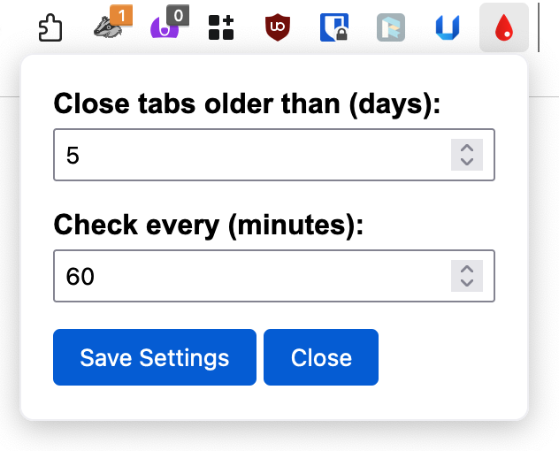

# Tab Stab

Tab Stab is a Firefox add-on that automatically and silently closes tabs that are older than the specified number of days (default is 7 days). It's so clever, it leaves pinned tabs untouched. I call this innovation.

## Why?

Because tab hoarding is a sin.

## How?

To install the add-on, follow these steps:

1. Get the latest code from this repository (you know how to do that, right?)
2. In Firefox, go to `about:debugging`
3. Switch to **This Firefox** (left sidebar)
4. Click **Load Temporary Add-on**
5. Select any file from the _firefox-add-on_ folder
3. Pin the add-on to the toolbar to access its settings

If this works, create an XPI file and install it:

1. Start Terminal and switch to the _firefox-add-on_ directory
2. Run the `find . -type f -not -name ".DS_Store" -not -path "./.git/*" | sort | zip -@ ../tab-stab.xpi` command
3. In Firefox, go to `about:config`
4. Search for `xpinstall.signatures.required` and set it to `false`
5. Drag the _tab-stab.xpi_ file into Firefox to install it

## Problems?

¯\\_(ツ)_/¯

## License

License? What license? It's public domain.